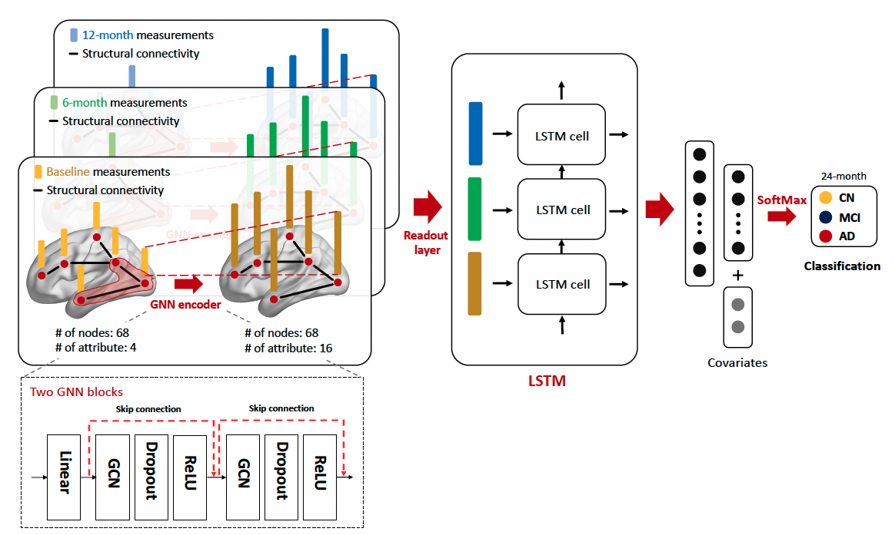

## Interpretable temporal graph neural network for prognostic prediction of Alzheimer’s disease using longitudinal neuroimaging data
IEEE BIBM 2021 (Accepted) \
 

### Dependencies
pytorch >= 1.9.0 \
torch_geometric == 1.7.2 \
nilearn >= 0.8.0 \
nibabel >= 3.2.1

### Citation

** License
Software code is under MIT license
